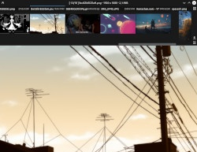
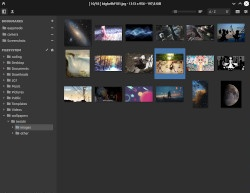

qimgv | Current version: 0.9.1
=====
Qt5 image viewer. Fast, configurable, easy to use. Optional video support.

## Screenshots

Main window & panel        |  Folder view   |  Settings window  
:-------------------------:|:-------------------------:|:-------------------------:|
[](qimgv/distrib/screenshots/qimgv0.9_1.jpg?raw=true)  |  [](qimgv/distrib/screenshots/qimgv0.9_2.jpg?raw=true) | [](qimgv/distrib/screenshots/qimgv_3.jpg?raw=true)

## [qimgv v0.6 video overview](https://www.youtube.com/watch?v=AODRGCRPCpw)

## Key features:

- Simple UI

- Fast

- Easy to use

- Fully configurable, including shortcuts

- High quality scaling

- Basic image editing: Crop, Rotate and Resize

- Ability to quickly copy / move images to different folders

- Experimental video playback via libmpv

- Ability to run shell scripts

- A nice dark theme, should look identical on every OS / DE

## Default control scheme:

| Action  | Shortcut |
| ------------- | ------------- |
| Next image  | Right arrow / MouseWheel |
| Previous image  | Left arrow / MouseWheel |
| Goto first image  | Home |
| Goto last image  | End |
| Zoom in  | Ctrl+MouseWheel / Crtl+Up |
| Zoom out  | Ctrl+MouseWheel / Crtl+Down |
| Zoom | Hold right mouse btn & move up / down |
| Fit mode: window | 1 |
| Fit mode: width | 2 |
| Fit mode: 1:1 (no scaling) | 3 |
| Switch fit modes  | Space |
| Toggle fullscreen mode  | DoubleClick / F / F11 |
| Exit fullscreen mode | Esc |
| Show image info  | I |
| Crop image  | X |
| Resize image  | R |
| Rotate left  | Ctrl+L |
| Rotate Right  | Ctrl+R |
| Open containing directory | Ctrl+D |
| Slideshow mode | ~ |
| Shuffle mode | S |
| Quick copy  | C |
| Quick move  | M |
| Move to trash | Delete |
| Delete file  | Shift+Delete |
| Save  | Ctrl+S |
| Save As  | Ctrl+Shift+S |
| Open | Ctrl+O |
| Settings  | Ctrl+P |
| Exit application | Esc / Ctrl+Q / Alt+X / MiddleClick |

... and more.

Note: you can configure every shortcut by going to __Settings > Controls__

## User interface

The idea is to have a uncluttered, simple and easy to use UI. You can see ui elements only when you need them.

There is a pull-down panel with thumbnails, as well as folder view (accessible by pressing Return).

You can also bring up a context menu by right-clicking an image.

### Using quick copy / quick move panels

Bring up the panel with C or M shortcut. You will see 9 destination directories, click them to set them up.

With panel visible, use 1 - 9 keys to copy/move current image to corresponding directory.

When you are done press C or M again to hide the panel.

### Running scripts

You can run custom scripts on a current image.

Open __Settings > Scripts__. Press Add. Here you can choose between a shell command and a shell script. 

Example of a command: 

`convert %file% %file%_.pdf`

Example of a shell script file: 
```
#!/bin/bash
gimp "$1"
```
_Note: The $1 argument will be a full file path. Also, the script file must be an executable._

When you've created your script go to __Settings > Controls > Add__, then select it and assign a shortcut like for any regular action.

### HiDPI

If qimgv appears too small / too big on your display, you can override the scale factor. Example:
```
QT_SCALE_FACTOR="1.5" qimgv /path/to/image.png
```
You can put it in `qimgv.desktop` file to make it permanent. Using values less than `1.0` may break some things.

qimgv should also obey the global scale factor set in kde's systemsettings.

### High quality scaling

qimgv supports nicer scaling filters when compiled with `opencv` support (ON by default, might vary depending on your distribution). Filter options are available in __Settings > Scaling__. `Bicubic` or `bilinear+sharpen` is recommended.

### APNG support

APNG is supported via third-party qt plugin. (Included in windows qimgv package)
 
If you are linux user, install the latest [QtApng by Skycoder42](https://github.com/Skycoder42/QtApng).

### HEIF / HEIC support

Apple's `heif` format is supported via third-party qt plugin. Included in windows qimgv package.

See [github.com/jakar/qt-heif-image-plugin](https://github.com/jakar/qt-heif-image-plugin)

### AVIF support

qimgv can open `avif` files via third-party qt plugin.

See [github.com/novomesk/qt-avif-image-plugin](https://github.com/novomesk/qt-avif-image-plugin)

### RAW support

Viewing raw is supported via [qtraw plugin](https://gitlab.com/mardy/qtraw). (Included in windows qimgv package)


## Installation instructions

### GNU+Linux

__Arch Linux / Manjaro / etc.:__ 

AUR package: 

```
qimgv-git
```
  
__Ubuntu / Linux Mint / Pop!\_OS / etc.__

```
sudo add-apt-repository ppa:easymodo/qimgv
sudo apt install qimgv
```
_Alternative package with kde support:_
```
sudo apt install qimgv-kde
```

__Gentoo:__

```
emerge qimgv
```

__OpenSUSE__: 

```
zypper install qimgv
```

__Void linux__: 

```
xbps-install -S qimgv
```

__Alpine Linux__:

```
apk add qimgv
```

__Fedora__: 

```
sudo dnf install qimgv
```

If your favorite distro is not included refer to [Manual install] section at the end of this document.
  
### Windows builds

  [Grab the latest release here.](https://github.com/easymodo/qimgv/releases)
  
  Windows builds are portable (everything is contained within install folder).
  
  Installer additionally sets up file associations.
  

### Manual install

Note: in order to compile you will need gcc 8 or later!
 
__Install dependencies ( `gcc` >= 8, `git`, `cmake` >= 3.13, `qt` >= 5.9, `exiv2`, `mpv`, `opencv (core and imgproc` )__

_Ubuntu & derivatives:_
     
```
sudo apt install build-essential git cmake qt5-default libmpv-dev gcc-8 g++-8
```
Optional: `libkf5windowsystem-dev`
     
_Fedora:_

Enable RPMFusion [https://rpmfusion.org/Configuration](https://rpmfusion.org/Configuration).

It is needed for video playback (mpv), but you also can build without it. See __CMake build options__ at the end.

```
sudo dnf install git cmake make qt5 qt5-devel gcc-c++ mpv mpv-libs-devel exiv2-devel opencv opencv-devel
```
Optional: `kf5-kwindowsystem`
		
__Configure & install__

Get sources

```
git clone https://github.com/easymodo/qimgv.git
cd qimgv && mkdir -p build && cd build
```

Configure

```
cmake ../ -DCMAKE_INSTALL_PREFIX=/usr/ -DCMAKE_INSTALL_LIBDIR=lib
```

Build

```
make -j`nproc --ignore=1`
```

Install

```
sudo make install
```

### Possible build issues

- If you get errors like "/usr/lib64 exists in filesystem" during install:

add `-DCMAKE_INSTALL_LIBDIR:PATH=/usr/lib` to cmake command.

- If you get some errors like "std::filesystem not found":

qimgv needs a compiler with c++17 support - for example gcc 8.0+ (every recent distro has it)

If you have multiple version of gcc installed you _might_ need to specify a which version for `cmake` to use, for example 

`CC=gcc-8 CXX=g++-8 cmake [........]`

### CMake build options

| Option  | Default value | Description |
| ------- | ------------- | ----------- |
| VIDEO_SUPPORT | ON | Enables video playback via `mpv` |
| EXIV2 | ON | Support reading exif tags via `exiv2` |
| OPENCV_SUPPORT | ON | Enables high quality scaling options |
| KDE_SUPPORT | OFF | Use some features from kde, like background blur |

Usage example:
```
cmake ../ -DKDE_SUPPORT=ON  -DCMAKE_INSTALL_PREFIX=/usr/
```
